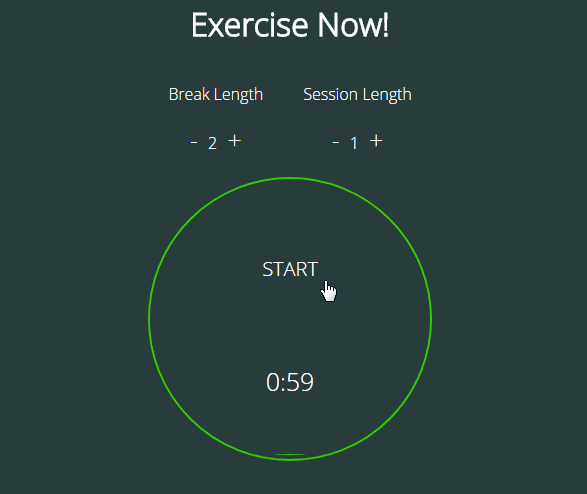
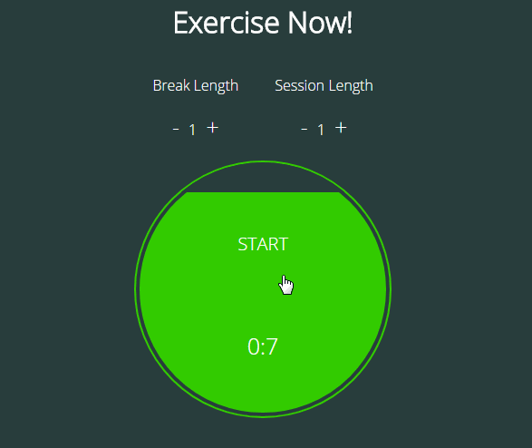
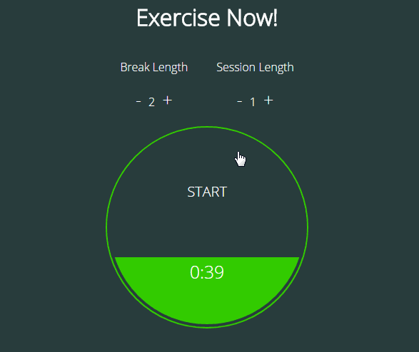

# AngularJs counter

AngularJs版健身计时器，[demo在此](https://therefor.github.io/angularjs-counter/)。

> 计时器分为健身（session）倒计时和休息（break）倒计时

> 健身session结束之后，计时器会自动跳转到break倒计时

> 点击倒计时区域，计时器将暂停，此时可以设置break和session的时长

